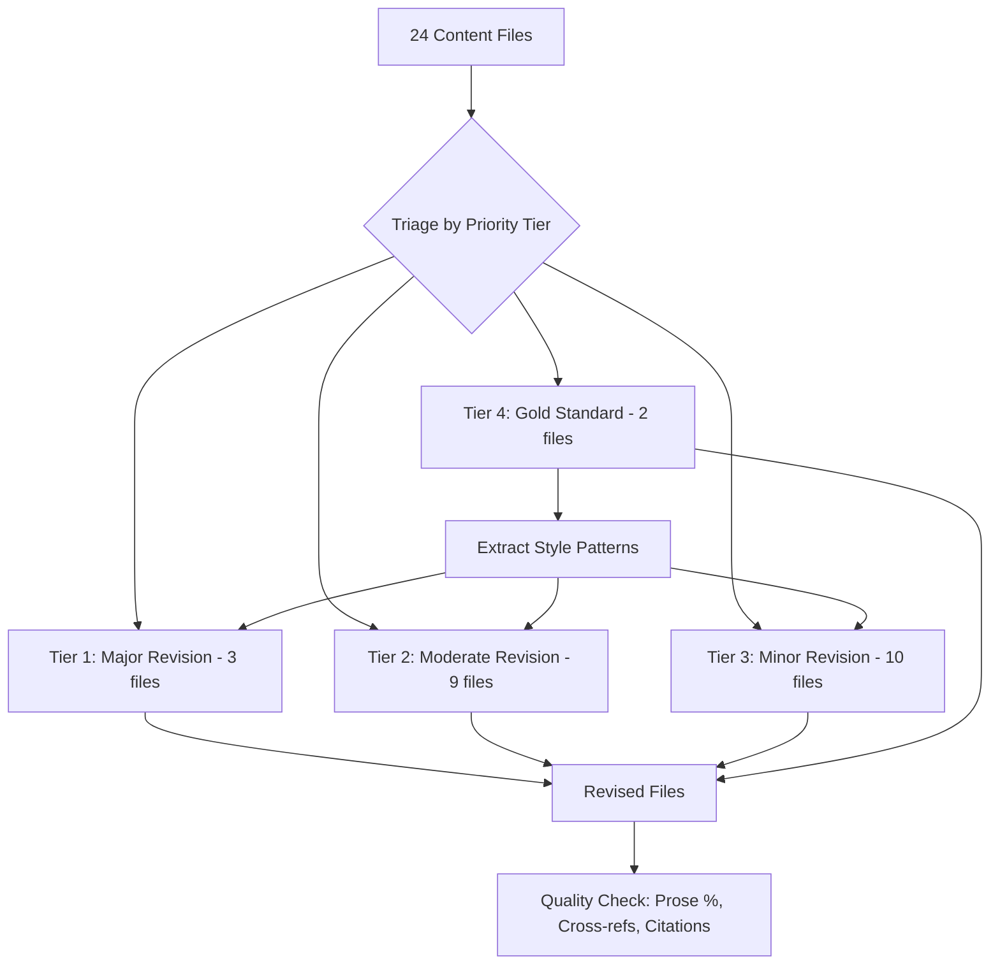

# Design: Content Quality Revision

## Overview

Revise all 24 educational content files in the BodySpec Learn platform to achieve consistent, high-quality prose across modules and deep-dives. The content covers DEXA body composition education for healthcare providers and fitness professionals.

The core problem: quality is uneven. Some files read as polished articles (e.g., `core/01-how-dexa-works.md` at 75% prose with strong narrative flow). Others read as reference lists (e.g., `sarcopenia/01-sarcopenia-aging.md` at 40% prose, listing 7 pathophysiology factors with zero explanation). Every file should read like a well-written article — with introductions, narrative flow, and explanations — where tables and lists support the prose rather than replace it.

No factual content changes. Same topics, same coverage, better writing.

## Detailed Requirements

### What changes
1. **Transform list-heavy content into prose.** Bare bullet lists and unexplained tables should become narrative text. Tables remain when they genuinely help (comparisons, thresholds, reference values) but must be embedded in surrounding prose.
2. **Add proper introductions.** Every section opens with 2-3 sentences stating what the topic is and why it matters. No section starts with a bare heading followed by a list or table.
3. **Remove cross-references.** Replace "in the previous section..." with in-context re-introductions when needed, or drop entirely.
4. **Follow citation conventions.** Inline `(Author et al., Year)[^N]` with full references at file end. Every quantitative claim needs a source.
5. **Maintain self-containment.** Each section should be independently comprehensible without requiring the reader to have read other sections.

### What does NOT change
- Factual/technical content and subject coverage
- Image and diagram references (preserved exactly)
- The four callout block types (`:::note`, `:::tip`, `:::clinical`, `:::warning`)
- File names and locations
- Module YAML metadata

### Constraints
- Tone: professional, accessible, authoritative (not clinical jargon, not casual)
- Heading hierarchy: H2 for major sections, H3 for subsections, no deeper
- Tables allowed where they add genuine value — but always with prose context before and after
- Existing citations must be preserved; uncited quantitative claims should gain citations where possible

## Architecture Overview

This is a content revision project — no code architecture involved. The "architecture" is the revision workflow.

### Revision Workflow Per File

1. Read the file and identify specific issues (per content audit)
2. Revise using the style guide patterns extracted from gold standard files
3. Verify: no cross-references, all images preserved, citations intact, prose ratio improved
4. Compare against gold standard tone and structure

## Components and Interfaces

### Priority Tiers

**Tier 1 — Major Revision (3 files)**

These files have prose ratios at or below 50% and structural problems. They need the most work.

| File | Current Prose % | Primary Issue |
|------|----------------|---------------|
| `sarcopenia/01-sarcopenia-aging.md` | 40% | Reads like reference doc; pathophysiology is a bare list of 7 items with no explanation; assessment lists tests with no cut-points or interpretation |
| `core/03-key-metrics.md` | 50% | Each metric is definition + bare list; FFMI lacks narrative explaining why height-normalization matters; bone section is only 11 lines; A/G ratio has no clinical context |
| `glp1/01-tracking-weight-loss.md` | 50% | Special populations section is bare lists; concerning patterns section is only bullets with no explanation; introduction lacks preview of what will be covered |

**Tier 2 — Moderate Revision (9 files)**

These files have decent foundations but specific sections that are too list/table-heavy or lack narrative depth.

| File | Current Prose % | Primary Issue |
|------|----------------|---------------|
| `core/04-reading-reports.md` | 70% | Product-promotional tone (AI assistant section, dashboard marketing language) needs reframing as educational content |
| `physician/02-interpreting-results.md` | 50% | Tables are good but lack "why" explanations for thresholds; serial scan section is only 17 lines |
| `bone/02-clinical-context.md` | 55% | Osteosarcopenia section transition is abrupt; mechanostat theory undefined at first mention |
| `trainer/03-tracking-cadence.md` | 55% | Multiple tables without sufficient prose context; precision factors deserve expansion |
| `visceral-fat/02-intervention-tracking.md` | 55% | HIIT section underweight despite being framed as "particularly effective"; medication section too brief |
| `sarcopenia/02-intervention-monitoring.md` | 55% | MDC explanation is dense without worked example; red flags section is repetitive with escalation |
| `chiro/02-assessment-integration.md` | 60% | Case studies are brief vignettes; no discussion of when asymmetry is normal vs. pathological |
| `glp1/02-preserving-muscle.md` | 60% | Five protein strategies listed without prioritization; escalation section lacks decision-point guidance |
| `trainer/01-program-design.md` | 60% | Good coaching language but could deepen individual variation discussion |

**Tier 3 — Minor Revision (10 files)**

These files are well-written. Fixes are targeted: a missing citation, a brief explanation gap, a section that could be slightly expanded.

| File | Fix Needed |
|------|-----------|
| `core/01-how-dexa-works.md` | Near-perfect; check for any cross-references (none found) |
| `core/02-accuracy.md` | Add explanation of what CV% means and what "±" error units represent |
| `core/05-misconceptions.md` | Add citation for spot reduction claim; reduce FAQ redundancy with other files |
| `core/06-scan-preparation.md` | Add rationale for why timeframes differ (2hr meal vs 12-24hr exercise); expand medication section |
| `physician/01-clinical-indications.md` | Minor: add contraindication reasoning |
| `physician/03-patient-conversations.md` | Define "metabolically unhealthy normal weight" at first use |
| `physician/04-red-flags.md` | Minor: add pre-referral workup suggestions |
| `trainer/02-client-management.md` | Minor: expand handling-resistance section |
| `chiro/01-msk-relevance.md` | Minimal: possibly add clinical examples |
| `chiro/03-communication.md` | Add citation for "5-8% underestimate" claim |
| `bone/01-bone-density-basics.md` | Minor formatting; patient comm section could be tightened |

**Tier 4 — Gold Standard (2 files)**

These files define the quality bar. They should be read before revising any other file and used as reference for tone, structure, and prose density.

| File | Why It's the Standard |
|------|----------------------|
| `core/01-how-dexa-works.md` | 75% prose, excellent intro, strong narrative flow, clean citations, good callout usage |
| `visceral-fat/01-understanding-vat.md` | 70% prose, best deep-dive, flows smoothly from concept to clinical relevance, accessible yet authoritative |

## Data Models

Not applicable (content-only revision).

## Error Handling

### Risks and Mitigations

| Risk | Mitigation |
|------|-----------|
| Broken image references | Verify all `` paths are preserved exactly after each file revision |
| Lost citations | Compare reference count before/after revision; every `[^N]` must be accounted for |
| Tone drift across files | Use gold standard files as reference; review revised files against them |
| Over-expanding content | Focus on prose quality, not length. A 50% prose file doesn't need to double in length — it needs its lists turned into explanations |
| Uncited claims in new prose | Any new explanatory prose that introduces a quantitative claim must include a citation |
| Breaking callout syntax | Preserve `:::type` / `:::` block syntax exactly |

## Acceptance Criteria

### Per-File Criteria

- **Given** a revised content file, **when** examined for structure, **then** every section opens with introductory prose (2+ sentences) before any table or list
- **Given** a revised content file, **when** searched for cross-references, **then** zero instances of "previous section," "as we discussed," "we'll cover later," or equivalent phrases exist
- **Given** a revised content file, **when** compared to the original, **then** all `` image references are identical
- **Given** a revised content file, **when** compared to the original, **then** all `[^N]` citation footnotes are preserved (new ones may be added)
- **Given** a revised content file, **when** compared to the original, **then** all `:::` callout blocks are preserved in valid syntax
- **Given** a revised content file, **when** assessed for tone, **then** it reads as professional, accessible, and authoritative — matching `core/01-how-dexa-works.md` in voice

### Global Criteria

- **Given** all 24 revised files, **when** assessed as a set, **then** tone and style are consistent across all files
- **Given** all 24 revised files, **when** assessed for prose ratio, **then** no file has a prose ratio below 60%
- **Given** all Tier 1 files, **when** compared before/after, **then** prose ratio has increased by at least 20 percentage points
- **Given** any section in any file, **when** read in isolation, **then** it is comprehensible without reading any other section or file

## Testing Strategy

Since this is content revision (not code), "testing" means quality verification:

1. **Automated checks** (scriptable):
   - Grep for cross-reference phrases: "previous section", "as we discussed", "we covered", "next section", "we'll cover"
   - Verify all image paths from original files exist in revised files
   - Verify footnote count (revised >= original per file)
   - Check `:::` callout blocks are properly opened and closed

2. **Manual review**:
   - Read each revised file for tone consistency against gold standard
   - Verify tables are embedded in prose context (not bare)
   - Verify introductions exist for each major section
   - Spot-check that no factual content was lost

## Appendices

### A. Technology Choices

Not applicable — this is a content editing task using markdown files.

### B. Research Findings Summary

Full research is in `research/`:
- `content-audit.md` — per-file quality assessment with priority tiers
- `style-guide.md` — extracted tone, citation, and markdown conventions
- `cross-references.md` — inventory of all cross-references to remove

Key findings:
- 24 files total; quality ranges from 40% prose (sarcopenia-01) to 80% (misconceptions)
- Citation pattern: `(Author, Year)[^N]` with full refs at end — used consistently in the best files
- Only ~8 cross-reference instances to fix, mostly in deep-dive part-2 files
- Four callout types (`:::note`, `:::tip`, `:::clinical`, `:::warning`) used consistently

### C. Alternative Approaches Considered

1. **Full content rewrite**: Rejected — content is factually sound, only presentation needs improvement
2. **Template-based approach** (standardize every file to identical structure): Rejected — different topics warrant different structures; the constraint is quality, not uniformity
3. **Automated prose conversion**: Rejected — converting lists to prose requires understanding context and clinical nuance that can't be templated
