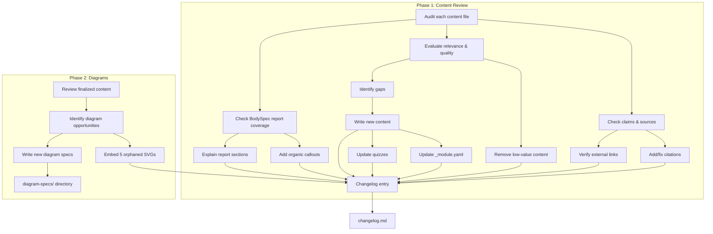

# Content Review — Detailed Design

## Overview

A comprehensive review and improvement of all educational content on the BodySpec Learn platform. The project covers three workstreams executed in two phases:

- **Phase 1 (Content):** General content review (claims, sources, gaps, low-value removal) combined with BodySpec scan report content review (differentiation, feature explanation, organic callouts). These run together since both involve editing the same markdown files.
- **Phase 2 (Diagrams):** After content is finalized, create detailed text-based specs for ALL diagrams (existing placeholders + new). All 14 current SVGs are placeholders and need full redesign specs.

All changes are made directly to content files, with a changelog documenting every edit.

---

## Detailed Requirements

### Sourcing Standards
- Every nonobvious factual or clinical claim must have a citation
- Acceptable sources: peer-reviewed studies, ISCD, ACSM, textbooks, authoritative clinical guidelines
- Don't bloat with footnotes — enough to be clearly credible
- Broken links: find replacement sources; remove unsourceable non-obvious claims
- Two existing external URLs must be verified: IAEA radiation page, ISCD 2023 positions

### Content Quality
- Tone: professional but accessible, leaning academic; varies by track and content
- Low-value content: remove if too basic for audience, irrelevant to practice, or excessively duplicative (minimal repetition is acceptable)
- All four tracks reviewed equally — no priority audience

### BodySpec Report Differentiation
- Compare against classical DEXA provider reports (generally basic, static PDFs)
- Highlight BodySpec advantages organically via callouts:
  - Interactive web dashboard (vs static PDF)
  - 450K+ comparison dataset with age/sex-stratified percentiles
  - Trend tracking across dozens of scans
  - Symmetry/limb imbalance analysis
  - Android/Gynoid ratio with metabolic context
  - VAT-specific analysis with percentile ranking
  - 24/7 AI assistant
  - Modern visuals, same-day results
- Explain each report section and its capabilities
- Reference: https://www.bodyspec.com/sample-report

### New Content
- Write new sections/units where gaps are identified
- Link new content into the site (update `_module.yaml` files)
- Add tests to maintain coverage

### Quizzes
- Review and update quiz questions to stay aligned with content changes
- Add new questions if new content sections warrant them
- Maintain 80% passing score standard

### Diagrams
- **All 14 existing SVGs are placeholders** — every one needs a full redesign spec
- Additionally identify any missing diagrams across all content
- Create detailed text-based specs in a new `diagram-specs/` directory for ALL diagrams (existing replacements + new)
- Each spec includes frontmatter noting target page/location and output path
- Ensure all 14 existing diagram references in content point to the correct filenames (update if renamed)
- Embed references for the 5 currently-unreferenced diagrams into their intended content files

### Deliverables
- Direct edits to all content files in `content/`
- Changelog document recording every edit (one entry per change)
- New content files where gaps are identified
- Updated `_module.yaml` files for new sections
- Updated quiz YAML files
- `diagram-specs/` directory with text-based diagram specifications
- Tests for any new content/functionality

---

## Architecture Overview



---

## Components and Interfaces

### File-by-File Review Order

Phase 1 processes content files in this order (core foundations first, then track-specific, then deep-dives):

**Core Module (review first — foundational for all tracks):**
1. `content/modules/core/01-how-dexa-works.md` — 0 citations, needs sources for technical claims
2. `content/modules/core/02-accuracy.md` — 5 citations, embed orphaned `method-comparison.svg`
3. `content/modules/core/03-key-metrics.md` — 4 citations, well-diagrammed
4. `content/modules/core/04-reading-reports.md` — 0 citations, **primary target for BodySpec report differentiation**; needs report section walkthrough with callouts
5. `content/modules/core/05-misconceptions.md` — 2 citations + 1 URL (verify IAEA link)

**Physician Module:**
6. `content/modules/physician/01-clinical-indications.md` — 2 citations
7. `content/modules/physician/02-interpreting-results.md` — 3 citations, embed orphaned `weight-loss-quality.svg`
8. `content/modules/physician/03-patient-conversations.md` — 0 citations (may be fine for communication content)
9. `content/modules/physician/04-red-flags.md` — 4 citations

**Chiropractor Module:**
10. `content/modules/chiropractor/01-msk-relevance.md` — 1 citation only (needs more for clinical claims)
11. `content/modules/chiropractor/02-assessment-integration.md` — 0 citations (case studies may need supporting refs)
12. `content/modules/chiropractor/03-communication.md` — 0 citations (likely fine)

**Trainer Module:**
13. `content/modules/trainer/01-program-design.md` — 2 citations
14. `content/modules/trainer/02-client-management.md` — 0 citations, embed orphaned `weight-loss-quality.svg`
15. `content/modules/trainer/03-tracking-cadence.md` — 2 citations

**Deep-Dives:**
16. `content/deep-dives/bone-health/01-bone-density-basics.md` — 3 citations + 1 URL (verify ISCD link)
17. `content/deep-dives/sarcopenia/01-sarcopenia-aging.md` — 6 citations, embed orphaned `sarcopenia-diagnostic-algorithm.svg`
18. `content/deep-dives/visceral-fat/01-understanding-vat.md` — 3 citations
19. `content/deep-dives/visceral-fat/02-intervention-tracking.md` — 4 citations
20. `content/deep-dives/glp1-monitoring/01-tracking-weight-loss.md` — 3 citations
21. `content/deep-dives/glp1-monitoring/02-preserving-muscle.md` — 4 citations

**Quizzes (after content is updated):**
22. `content/quizzes/core.yaml` — 8 questions
23. `content/quizzes/physician.yaml` — 8 questions
24. `content/quizzes/chiropractor.yaml` — 7 questions
25. `content/quizzes/trainer.yaml` — 8 questions

### Changelog Format

`specs/content-review/changelog.md` — one entry per edit:

```markdown
## [file path]

### Edit N: [type] — [brief description]
- **Type:** addition | correction | removal | source-update | callout | diagram-embed | quiz-update
- **Location:** [section/heading where edit occurs]
- **Before:** [brief summary or quote of original]
- **After:** [brief summary or quote of replacement]
- **Rationale:** [why this change was made]
```

### New Content Integration

When gaps are identified, new content follows these steps:
1. Write markdown file following existing naming convention (`NN-slug.md`)
2. Add section entry to the parent `_module.yaml`
3. Add quiz questions if the new section introduces testable knowledge
4. Add changelog entry
5. Add/update tests if needed for content loading or quiz validation

### Diagram Specs Format

Each spec file in `diagram-specs/`:

```markdown
---
target_file: content/modules/core/04-reading-reports.md
target_section: "## Summary Dashboard"
placement: after paragraph 2
output_path: content/assets/diagrams/report-summary-dashboard.svg
---

# Report Summary Dashboard Diagram

[Long detailed text description of the diagram...]
```

---

## Data Models

No database schema changes. All work is in markdown, YAML, and spec files.

**Files created:**
- `specs/content-review/changelog.md` — edit log
- `diagram-specs/*.md` — one file per diagram spec
- New content `.md` files as needed in `content/modules/` or `content/deep-dives/`

**Files modified:**
- Existing `.md` content files (source corrections, quality improvements, callouts)
- `_module.yaml` files (if new sections added)
- Quiz `.yaml` files (question updates/additions)

---

## Error Handling

- **Broken external URL:** Attempt to find replacement. If URL redirects, update to new URL. If completely dead with no replacement, remove the reference and note in changelog.
- **Unsourceable claim:** If a claim cannot be backed by any acceptable source and is not self-evidently true, remove it. Document removal in changelog with rationale.
- **Conflicting sources:** If sources disagree, prefer the most recent peer-reviewed systematic review or position statement. Note the conflict in the changelog.
- **Content that references missing assets:** Note in changelog; create a diagram spec if a visual would help, or remove the reference if the asset isn't critical.

---

## Acceptance Criteria

### Phase 1: Content

- **Given** a content file with an unsourced nonobvious claim, **when** the review is complete, **then** the claim either has an acceptable citation or has been removed.
- **Given** an external URL in any content file, **when** the review is complete, **then** the URL has been verified as reachable and accurate, or replaced/removed.
- **Given** the core module file `04-reading-reports.md`, **when** the review is complete, **then** it explains each section of the BodySpec report with organic callouts highlighting key differentiators (interactivity, 450K dataset, symmetry, trend tracking, AI assistant).
- **Given** any content file, **when** the review is complete, **then** the writing is professional but accessible, leaning academic, appropriate to its track audience.
- **Given** content gaps are identified (missing topics that should exist), **when** the review is complete, **then** new content has been written, linked into `_module.yaml`, and quiz questions added if appropriate.
- **Given** content has been modified, **when** the review is complete, **then** all related quiz questions are accurate and aligned with the updated content.
- **Given** any edit made during the review, **when** the changelog is checked, **then** there is exactly one entry per edit with type, location, before/after summary, and rationale.
- **Given** existing tests, **when** new content or quiz changes are made, **then** all tests pass and new tests are added if needed to maintain coverage.

### Phase 2: Diagrams

- **Given** all 14 existing SVGs are placeholders, **when** Phase 2 is complete, **then** every one has a detailed redesign spec in `diagram-specs/`.
- **Given** content files that would benefit from additional visual aids, **when** Phase 2 is complete, **then** a new diagram spec exists in `diagram-specs/` with frontmatter (target file, section, placement, output path) and a detailed text description.
- **Given** 5 currently-unreferenced diagrams, **when** Phase 2 is complete, **then** each is embedded in its intended content file with appropriate alt text.
- **Given** any diagram embed or spec, **when** the changelog is checked, **then** there is a corresponding entry.

---

## Testing Strategy

### Content Validation
- Run existing backend tests: `cd backend && python -m pytest tests/ -v`
- Run existing frontend tests: `cd frontend && npx vitest run --project unit`
- Verify content loading works for any new/renamed files
- Verify quiz YAML is valid and parseable
- Verify `_module.yaml` changes are consistent with file structure

### Source Verification
- Check 2 external URLs for reachability (IAEA, ISCD)
- Verify DOIs resolve for any newly added citations (spot-check)

### Manual Review
- Read through each modified file for tone consistency
- Verify callouts integrate organically (not forced or salesy)
- Check that quiz questions match updated content

---

## Appendices

### A. Technology Choices
- All content in Markdown with YAML frontmatter — no tooling changes needed
- Diagram specs are plain markdown with YAML frontmatter — generation is a separate future step
- Changelog is markdown — human-readable, version-controllable

### B. Research Findings Summary
- **Content structure:** 25 files, 4 tracks, 4 deep-dives, ~120 min reading time
- **Sources:** 37 citations, high quality but unevenly distributed. 7 files have zero citations. Core and chiropractor modules are lightest.
- **BodySpec report:** Rich interactive platform with 9+ differentiators vs classical DEXA. `04-reading-reports.md` is the primary file to enhance.
- **Quizzes:** 31 questions, 100% coverage, all with explanations. Need updates after content changes.
- **Diagrams:** All 14 existing SVGs are placeholders needing full redesign specs. 5 are also unreferenced in content. No visuals in any physician, chiropractor, or trainer content. Report samples entirely missing.

### C. Potential Content Gaps to Investigate During Review
- No section dedicated to BodySpec's AI assistant or dashboard interactivity
- No content on scan preparation best practices (hydration, timing, clothing)
- Chiropractor module has no deep-dive content
- Trainer module has no deep-dive content
- No content comparing BodySpec specifically to other body composition services
- Bone health deep-dive has only 1 section (could expand)
- No content on pediatric or adolescent body composition
- No content on DEXA for athletes beyond RED-S mention

### D. Alternative Approaches Considered
- **Audit-first approach:** Produce a full audit document before making any edits. Rejected because the user wants direct edits + changelog, not a two-pass process.
- **Track-by-track review:** Review all of one track before moving to the next. Rejected in favor of the file-by-file approach which allows core foundational content to be finalized first (since all tracks build on it).
- **Automated link checking:** Could use a script to batch-verify all URLs. Considered but only 2 external URLs exist, so manual verification is sufficient.
